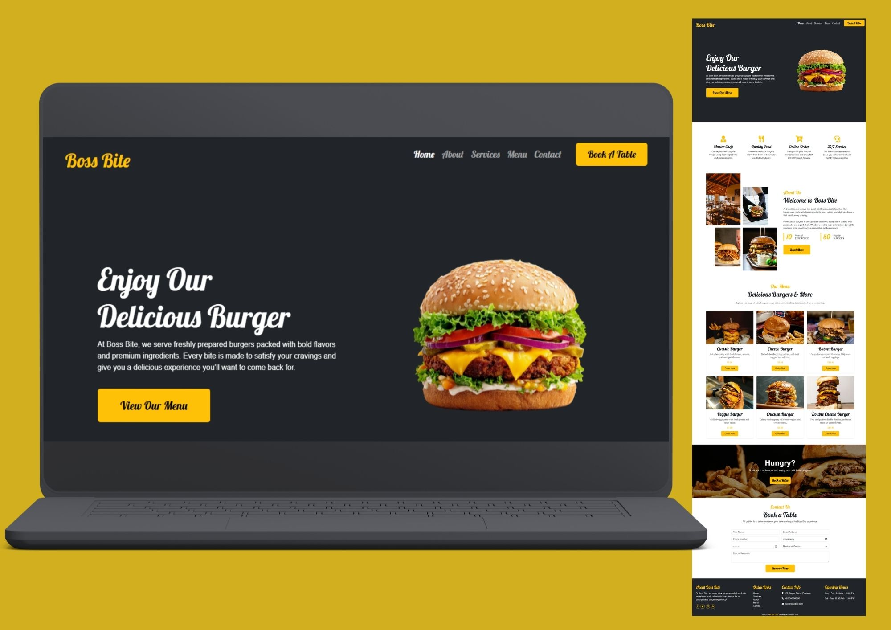

# 🍔 Boss Bite Restaurant Website

A modern and responsive burger restaurant website built using Bootstrap, HTML, CSS and JavaScript.

---

##  Features

- Responsive Navigation Bar  
- Hero Section with Burger Showcase  
- About Section  
- Services Section  
- Menu Cards with Items & Pricing  
- Parallax Banner Section  
- Contact / Book a Table Form  
- Back to Top Button  
- Elegant Footer  

---

##  Technologies Used

- HTML5  
- CSS3  
- Bootstrap 5  
- JavaScript  
- Animate.css  
- WOW.js  
- Font Awesome  

---

##  How to Run

1. Download or clone the project  
2. Open `index.html` in your browser  

---

##  Developer

Developed by **Ramsha Ayub**